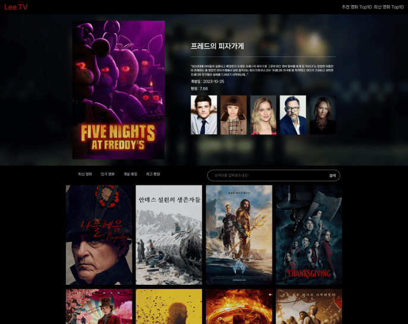

# Movie Site 만들기
tmdb API를 활용하여 영화 사이트를 만들었습니다. 

## 사이트 바로가기
사이트 바로가기 : [Movie](https://lee-movie.netlify.app/)

## 사용 스택
   

## 프로젝트 소개
Vue.js와 tmdb API와 Postman을 활용하여 영화 사이트를 구현하였습니다. 
최신 영화와 개봉 예정인 영화, 인기 영화, 최고 평점 영화 정보를있으며, 검색 기능을 통해 원하는 영화를 찾을 수 있게 구현하였습니다.

## 주요 기능
### 검색 기능
사용자가 검색어를 입력하고 엔터를 누르거나 검색 버튼을 클릭했을 때 ref를 사용하여 사용자가 입력한 검색어를 추적하고,  axios를 사용하여 TMDB API에 검색 요청을 보내고, 응답을 받아와서 검색 결과를 화면으로 출력하였습니다.

### 카테고리 기능
최신 영화, 인기 영화, 개봉 예정 영화, 최고 평점 영화 카테고리 중에 하나를 클릭하면 해당 카테고리에 맞는 API 엔드 포인트를 요청 보내어 영화 목록을 가져와 그 결과를 화면에 출력하였습니다.

### 영화 상세 정보 제공
컴포넌트가 마운트되었을 때 실행되는 라이프사이클 훅으로, API 호출하여 영화의 기본 정보, 비디오(트레일러), 상세 정보, 키워드, 크레딧 등을 보여주고 있습니다.
비디오(트레일러)에서는 트레일러가 존재할 경우에는 iframe을 사용하여 영화의 트레일러를 보여주고 없을 경우에는 영화의 포스터 사진이 나오게 하였습니다.